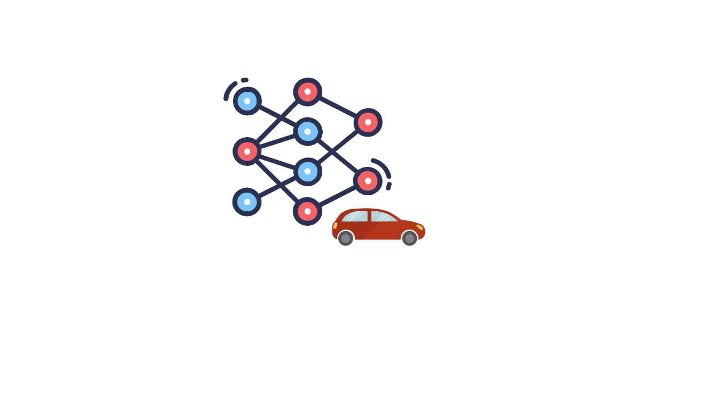
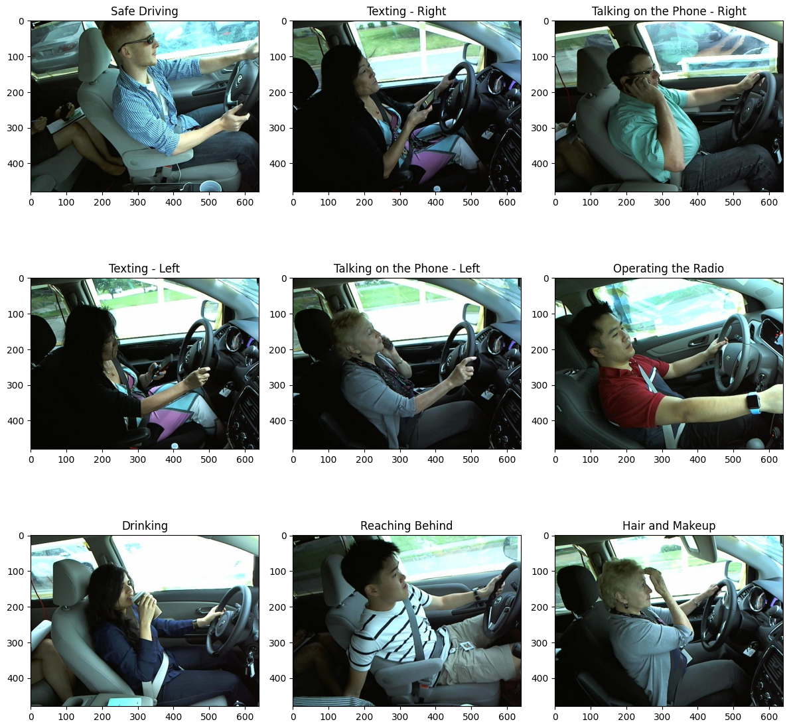
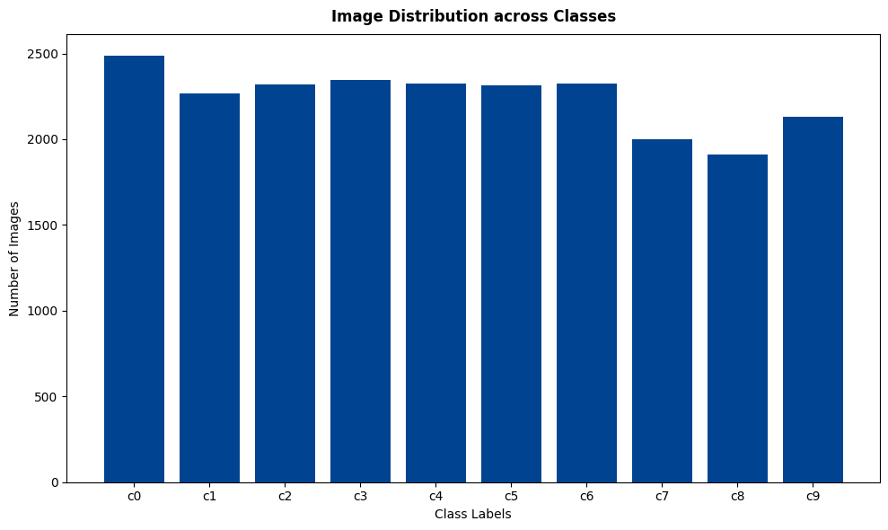
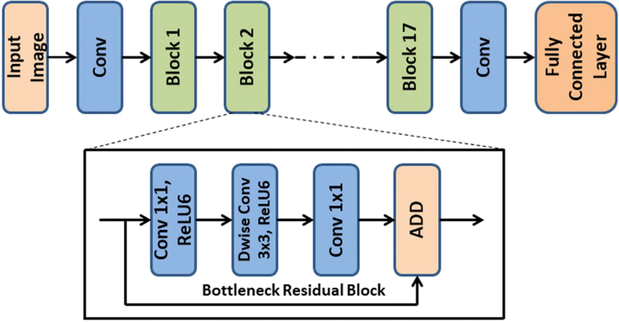
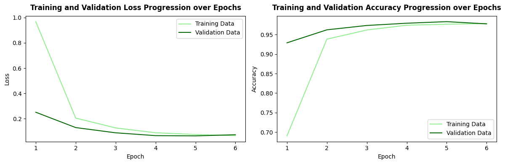
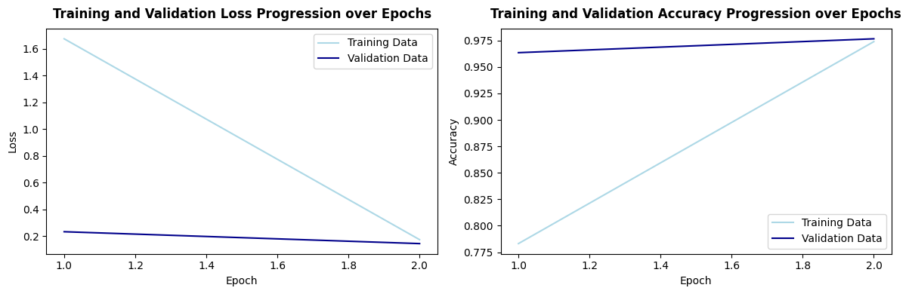
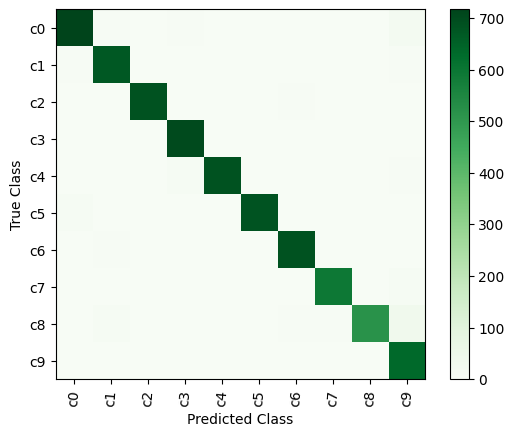
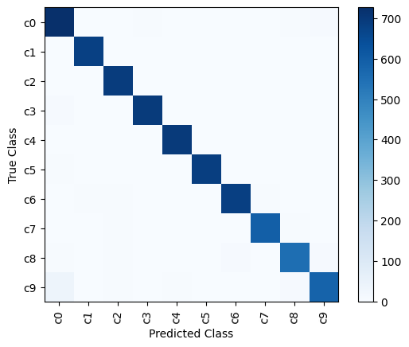
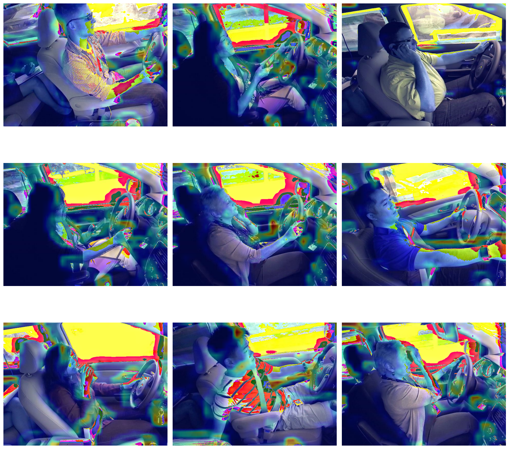
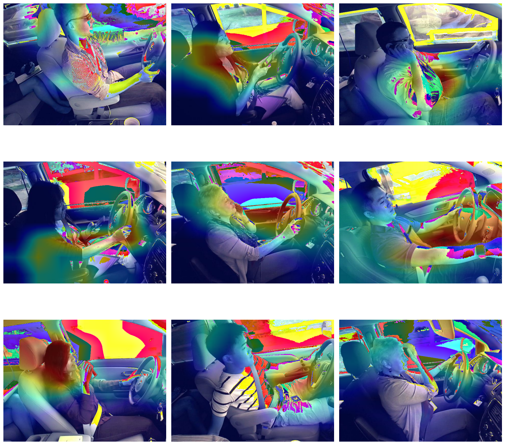

<p align="center">
  
</p>

<h1 align="center">Distracted Driver Detection</h1>
<h3 align="center">Driver Behavior Classification Using Deep Learning</h3>

<p align="center">
  <b>Stack:</b> Python · TensorFlow · Keras · OpenCV · Scikit-Learn
</p>

<p align="center">
  
  
  
</p>

---

## Overview

Distracted driving is one of the leading causes of road accidents worldwide. This project builds and benchmarks **6 deep learning models** - including custom CNNs and transfer learning architectures (VGG16, ResNet-50, MobileNetV2) - to classify driver behavior from in-car camera images into **10 distraction categories**, achieving up to **99.15% validation accuracy**.

<p align="center">
  
</p>

### Classification Categories

| Class | Behavior | Class | Behavior |
|-------|----------|-------|----------|
| **c0** | Safe driving | **c5** | Operating the radio |
| **c1** | Texting - right | **c6** | Drinking |
| **c2** | Phone call - right | **c7** | Reaching behind |
| **c3** | Texting - left | **c8** | Hair and makeup |
| **c4** | Phone call - left | **c9** | Talking to passenger |

---

## Dataset

- **Training set:** 22,424 images across 10 balanced classes
- **Test set:** 79,726 unlabeled images
- **Resolution:** 640 x 480 pixels (resized to 128x128 or 224x224 depending on model)
- **Source:** In-car dashboard camera captures

<p align="center">
  
</p>

---

## Project Structure

```
├── README.md
├── requirements.txt
├── .gitignore
├── notebooks/
│   ├── 01_custom_cnn_baseline.ipynb        # Custom CNN - baseline without augmentation
│   ├── 02_custom_cnn_augmented.ipynb       # Custom CNN - with data augmentation & vignette
│   ├── 03_vgg16_transfer_learning.ipynb    # VGG16 transfer learning
│   ├── 04_vgg16_tuned.ipynb               # VGG16 with Adagrad optimizer tuning
│   ├── 05_resnet50_transfer_learning.ipynb # ResNet-50 transfer learning
│   └── 06_mobilenetv2_transfer_learning.ipynb  # MobileNetV2 - lightweight architecture
├── models/                                 # Saved Keras model weights (.h5)
│   ├── distractions_model1_classifier.h5
│   ├── distractions_model2_classifier.h5
│   └── distractions_model6_classifier.h5
└── images/                                 # Architecture reference diagrams
    ├── vgg16-architecture.jpg
    ├── resnet50_architecture.png
    └── mobilenetV2_architecture.png
```

---

## Methodology

Each notebook follows a structured pipeline: **Data Exploration → Preprocessing → Model Definition → Training → Evaluation → Inference**.

### Approach 1: Custom CNN (Built from Scratch)

A lightweight 3-layer convolutional architecture designed to establish baseline performance:

```
Conv2D(32) → MaxPool → Conv2D(64) → MaxPool → Conv2D(128) → Dropout(0.5) → Flatten → Dense(10, softmax)
```

- **Model 1** trains without augmentation to measure raw model capacity
- **Model 2** adds a custom augmentation pipeline including a **vignette effect** to suppress background noise from car windows

### Approach 2: Transfer Learning (Pre-trained on ImageNet)

Leveraging architectures pre-trained on ImageNet's 14M+ images, with frozen convolutional bases and custom classification heads:

<p align="center">
  
</p>
<p align="center"><i>VGG16 Architecture - 16 weight layers with 3x3 convolutions (Models 3 & 4)</i></p>

<p align="center">
  
</p>
<p align="center"><i>ResNet-50 Architecture - 50 layers with residual skip connections (Model 5)</i></p>

<p align="center">
  
</p>
<p align="center"><i>MobileNetV2 Architecture - inverted residual blocks optimized for mobile deployment (Model 6)</i></p>

### Data Augmentation Strategy

Models 2, 3, 4, and 6 employ a custom augmentation pipeline to improve robustness:

- **Geometric transforms:** rotation (4°), width/height shifts, shear, zoom
- **Photometric transforms:** brightness variation (0.9–1.4x range)
- **Custom vignette effect:** Gaussian-weighted darkening of image periphery to force the model to focus on the driver rather than background scenery

---

## Results

### Performance Summary

| Model | Architecture | Optimizer | Learning Rate | Augmentation | Accuracy | Training Time | Test Result |
|:-----:|:------------|:---------:|:------------:|:------------:|:--------:|:------------:|:-----------:|
| 1 | Custom CNN | Adam | 0.001 | No | **99.15%** | 17 min | 4/5 |
| 2 | Custom CNN | Adam | 0.005 | Yes | 97.83% | 19 min | **5/5** |
| 3 | VGG16 | Adam | 0.005 | Yes | 97.26% | 84 min | 4/5 |
| 4 | VGG16 | Adagrad | 0.01 | Yes | 97.90% | 40 min | **5/5** |
| 5 | ResNet-50 | RMSprop | 0.01 | No | 21.46% | 40 min | - |
| 6 | MobileNetV2 | SGD | 0.003 | Yes | 97.53% | 40 min | 4/5 |

> Models **2** and **4** achieved **flawless classification on all test samples**, demonstrating that both a well-tuned custom CNN and VGG16 with optimized hyperparameters can reliably detect driver distractions.

### Training Convergence

Training/validation loss and accuracy curves for Model 2 showing rapid convergence

<p align="center">
  
</p>

Training/validation loss and accuracy curves for Model 4 showing fast VGG16 convergence

<p align="center">
  
</p>


### Confusion Matrices

Confusion matrix for Model 2 shows a strong diagonal:

<p align="center">
  
</p>

As well as confusion matrix for Model 4:

<p align="center">
  
</p>
---

## Model Interpretability: Grad-CAM Analysis

Gradient-weighted Class Activation Mapping (Grad-CAM) was applied to visualize which regions of the image each model focuses on when making predictions.

3x3 Grad-CAM heatmap grid from the custom model 1 cnn shows attention on both driver and background

<p align="center">
  
</p>

3x3 Grad-CAM heatmap grid from mobilenetv2 model 6 shows improved focus on driver body

<p align="center">
  
</p>

**Key finding:** Models without data augmentation tend to learn from extraneous background patterns (scenery outside the car window). The custom vignette preprocessing and augmentation pipeline significantly improved the model's focus on the driver's body and actions.

---

## Key Findings

- **Data augmentation is critical** - even with 22K+ training images, augmentation with vignette effects improved generalization and shifted model attention toward relevant features
- **Custom CNNs are competitive** - a simple 3-layer CNN achieved 99.15% validation accuracy, demonstrating that architectural complexity is not always necessary
- **Transfer learning accelerates convergence** - VGG16 and MobileNetV2 reached high accuracy in fewer epochs, though at higher computational cost per epoch
- **Optimizer selection matters** - Adam and Adagrad performed consistently well; RMSprop with a high learning rate (0.01) caused ResNet-50 to fail to converge
- **Learning rate is the most sensitive hyperparameter** - the gap between Model 5's failure (21%) and Model 4's success (98%) highlights its impact

---

## Getting Started

### Prerequisites

```bash
pip install -r requirements.txt
```

### Running the Notebooks

```bash
jupyter notebook notebooks/01_custom_cnn_baseline.ipynb
```

The dataset should be placed in a `Data/` directory at the project root with the following structure:
```
Data/
├── driver_imgs_list.csv
└── imgs/
    ├── train/
    │   ├── c0/
    │   ├── c1/
    │   └── ...
    └── test/
```

---

## Future Work

- **Hyperparameter optimization:** Apply systematic search (Bayesian, grid, or random) across all architectures
- **Advanced augmentation:** Experiment with Cutout, MixUp, or CutMix strategies to further reduce background noise sensitivity
- **Learning rate scheduling:** Implement cosine annealing or reduce-on-plateau callbacks for better convergence
- **Fine-tuning pre-trained layers:** Unfreeze top convolutional blocks for domain-specific feature adaptation
- **Ensemble methods:** Combine predictions from Models 2, 4, and 6 for improved robustness
- **Edge deployment:** Optimize MobileNetV2 with TensorFlow Lite for real-time in-vehicle inference
